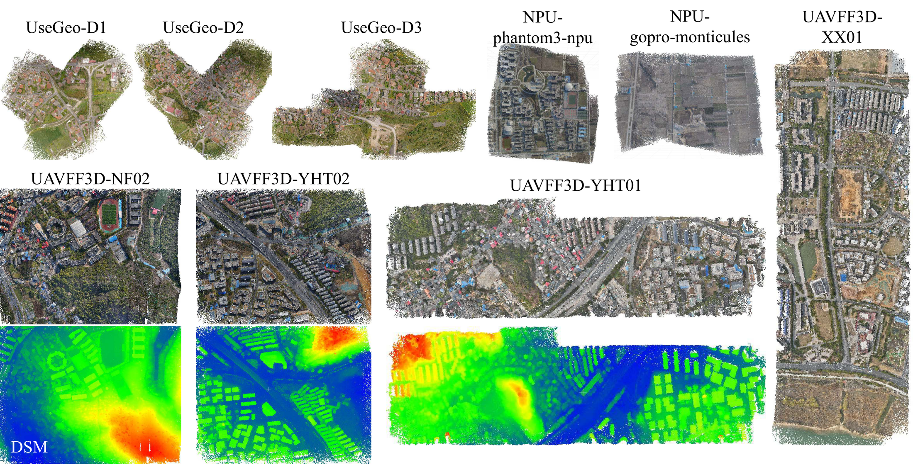

# GeoFF3D



GeoFF3D is a scalable feed-forward framework for large-scale UAV 3D reconstruction. It combines coordinate-anchored reconstruction with spatial chunking and hierarchical aggregation, and supports camera, depth, translation, and rotation priors.

## Installation

The tested environment uses Python 3.12, PyTorch 2.5.0, and CUDA 12.1 wheels.
The commands below intentionally pin the CUDA-dependent packages to the same
versions as the verified MapAnything environment.

```bash
git clone https://github.com/yanxian-ll/GeoFF3D.git
cd GeoFF3D

# Create and activate the environment.
conda create -n geoff3d python=3.12 -y
conda activate geoff3d

# Build and packaging tools.
conda install -y -c conda-forge git ninja cmake
python -m pip install -U pip setuptools wheel packaging psutil ninja

# Verified PyTorch/CUDA combination.
python -m pip install \
  torch==2.5.0 torchvision==0.20.0 torchaudio==2.5.0 \
  --index-url https://download.pytorch.org/whl/cu121
python -m pip install torch-scatter==2.1.2 \
  -f https://data.pyg.org/whl/torch-2.5.0+cu121.html
python -m pip install --no-cache-dir \
  --index-url https://download.pytorch.org/whl/cu121 \
  xformers==0.0.28.post2
python -m pip install torch-cluster \
  -f https://data.pyg.org/whl/torch-2.5.0+cu121.html

# Install GeoFF3D and the remaining Python dependencies. The package metadata
# pins torch, torchvision, and xformers, so this keeps the versions above.
pip install -e .
```

Optional development tools can be installed after the main package:

```bash
pip install pre-commit pytest pytest-cov ruff
pre-commit install
```

Place pretrained weights under `checkpoints/`. The default Pi3X path is `checkpoints/pi3x`; override it with `PI3X_BASE_MODEL` if needed.

Configure the data and output paths:

```bash
export DATA_ROOT=/path/to/data
export METADATA_ROOT=/path/to/metadata
export EXPERIMENTS_ROOT=/path/to/experiments
```

Dataset configurations are located in `configs/dataset/`.

## Training

The argument is the number of GPUs.

```bash
# GeoFF3D
bash bash_scripts/train/geoff3d_stage1.sh 2
bash bash_scripts/train/geoff3d_stage2.sh 2

# Baselines
bash bash_scripts/train/pi3_finetuning.sh 2
bash bash_scripts/train/pi3x_finetuning.sh 2
bash bash_scripts/train/vggt_finetuning.sh 2
bash bash_scripts/train/vggt_omega.sh 2
```

Stage 2 loads the default Stage 1 output automatically. To use another checkpoint:

```bash
STAGE1_CHECKPOINT=/path/to/checkpoint-last.pth \
bash bash_scripts/train/geoff3d_stage2.sh 2
```

## Large-scene reconstruction

Each launcher reconstructs one scene directly with `scripts/run_slrf.py`:

```bash
bash bash_scripts/run_slrf/geoff3d.sh \
  /path/to/scene \
  /path/to/output
```

Available scripts:

```text
geoff3d.sh
pi3x.sh
vggt.sh
vggt_omega.sh
```

To avoid GT-depth footprints, set
`FOOTPRINT_ESTIMATION=sequential` on any method script. A preliminary
pass sorts the inputs into non-overlapping sequential chunks and merges a tail
smaller than 8 images into the previous chunk. Its aligned predictions provide
the footprints for the normal spatial chunking pass. GeoFF3D uses
`scale_yaw_translation`; Pi3X, VGGT, and VGGT-Omega use `sim3`.

Each script uses its matching checkpoint by default. A custom checkpoint and
additional Hydra overrides can be supplied with:

```bash
CHECKPOINT=/path/to/checkpoint-best.pth \
bash bash_scripts/run_slrf/geoff3d.sh \
  /path/to/scene \
  /path/to/output \
  max_chunk_size=24
```

### Export spatial chunk image lists

To run the same prior-depth footprint-tree partition without model inference,
provide the scene directory and the maximum total image count per chunk:

```bash
python scripts/export_chunk_image_lists.py \
  /path/to/scene \
  32
```

The scene must contain matching `images/`, `cams/*.txt`, and metric
`depth/*.exr` files. No checkpoint or GPU is required. Outputs are written to
`<scene_dir>/chunk_image_lists/` by default:

```text
chunk_0000.txt
chunk_0001.txt
...
chunk_image_names.json
```

Each text file contains all image file names in that chunk, including overlap
images. The JSON manifest additionally records core images, overlap images,
adjacency, and unassigned images. Use `--output-dir` to change the destination,
`--footprint-workers` to parallelize depth-footprint estimation, and
`--min-images-per-chunk 8` to match the current `configs/slrf.yaml` minimum.

## Benchmarking

The private reproducibility workspace under `benchmarking/` contains unified runners
for our SLRF methods, streaming and optimization-based baselines, ablations, and
efficiency/scalability experiments. Dataset, checkpoint, and method paths are configured
in the YAML file beside each runner. Results are written to
`experiments/benchmarking/`.

```bash
python benchmarking/bash_scripts/ours/run_all.py
bash benchmarking/bash_scripts/stream/run_all.sh
bash benchmarking/bash_scripts/optim/run_all.sh
bash benchmarking/bash_scripts/ablation/run_all.sh
bash benchmarking/bash_scripts/efficiency_scalability/run_all.sh
```

See [benchmarking/README.md](benchmarking/README.md) for input formats, configuration,
outputs, checkpoints, and result statistics.

## Acknowledgements

This project is developed primarily upon [MapAnything](https://github.com/facebookresearch/map-anything). We sincerely thank its authors for releasing their excellent work. We also thank the authors of [Pi3](https://github.com/yyfz/Pi3), [VGGT](https://github.com/facebookresearch/vggt), and the related open-source projects used by this repository.

## License

See [LICENSE](LICENSE).

## Citation

If this repository is useful to your research, please cite the [UAVFF3D paper](https://arxiv.org/abs/2605.17942):

```bibtex
@article{yang2026uavff3d,
  title={UAVFF3D: A Geometry-Aware Benchmark for Feed-Forward UAV 3D Reconstruction},
  author={Yang, Xiang and Wang, Yongli and Li, HaiFeng and Zhang, Yunsheng},
  journal={arXiv preprint arXiv:2605.17942},
  year={2026}
}
```
